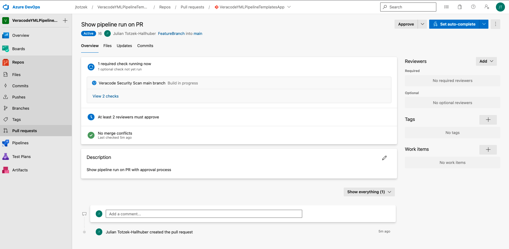

<br>  
  
# Veracode-manual-for-Azure-DevOps

## Overview  
  
This documentation should help Veracode customers to understand how they can integrate Veracode scanning technologies into Azure DevOps. It is almost universal to many other CI/CD tools, but this documentation is mainly focused on Azure DevOps and it's specifics.  
Using this documentation you will be able to automate static, SCA and dynamic scanning from within your Azure DevOps pipeline. As well you will learn how to scale application security testing in a larger organization with a lot of repositories.  
  
## Veracode Scanning Technologies
### Static Analysis  
Veracode offers 3 types of static analysis  
1. Pipeline Scan 
2. Sandbox Scan  
3. Policy Scan  
  
All 3 are run on different needs and have different purposes, all are based on the same engine in the background and all 3 should find the exact same results if the same binary is uploaded.  

1. Pipeline Scan  
The Veracode Pipeline Scan was designed as a fast feedback tool for developers and may runs with every single commit. It can rate in very early stages what are the policy relevant findings a developer need to fix in order to achieve policy compliance later on. As well it gives you the possibility to see net-new findings of a single commit.  
It can scan the full application or smaller parts that have changed.  
  
2. Sandbox Scan  
Similar to the Pipeline Scan, the Sandbox scan runs in early stages of your code. It's purpose is to scan the full application and rate the findings according to the profile's policy. This will allow you to see findings that need to be fixed in order to achieve policy compliance later one.  
  
3. Policy Scan  
The Policy Scan is the last gate to production. It should scan the full application and according to the policy compliance you can decide wether the application is allowed to be deployed or not.  

### Software Composition Analysis  
Software Composition Analysis at Veracode can be done in 2 different ways.  
  
1. With static analysis (Upload and Scan)  
2. Individual SCA scan of the application and docker containers (Agent Based Scan)  
  
On this documentation we will mainly talk about the Agent Based Scan, that could run on every stage of your code.  

### Dynamic Analysis  
Veracode#s Dynamic Analysis gives you the possibility to scan standard or single page web applications and as well API's while they are running either at a staging environment or at production.  
Both types of scan will be run and configured the exact same way.  
  
## Automation Process  
The picture below should highlight in a visual way which scan type runs at which stage of your code. It also is "only" Veracode's idea how it makes sense to implement a good process to application security testing.  
Every organization is doing this a bit differently, depending on how their processes are set up. Veracode gives you the flexibility to choose which scan type should run where on your different stages of your pipeline and your code.  
  
  
  
## Integrating into Azure DevOps  
This documentation includes 2 Azure DevOps projects to show an example how to use all Veracode scanning technologies, in an automated way on your Azure DevOps pipeline. There are examples on static analysis, software composition analysis, dynamic analysis and results import as Azure DevOps Work Items.  
The 4 projects are:  
  
1. [Veracode-manual-for-AzureDevOps](https://dev.azure.com/jtotzek/VeracodeYMLPipelineTemplatesApp)  
This documentation and a demo app with demo pipelines  
2. [Pipeline-Templates](https://dev.azure.com/jtotzek/VeracodeYMLPipelineTemplates)  
yml templates to be used on your pipeline.  
  
## General Azure DevOps secret variables  
For all scanning and reporting work properly you need to set up a few pipeline variables that will be (automatically) picked up by the pipeline tasks. The configuration will be done on your pipeline configuration and variables.  
3 Variables are the required minimum for this example to work properly.  
- VERACODE_API_ID  
The Veraocde API ID for your API credentials. This is used by most of the tasks to authenticate and check the user roles for authorization. Please refer to this documentation [Generating Veracode API Credentials](https://docs.veracode.com/r/t_create_api_creds)   
- VERACODE_API_KEY  
The Veraocde API Secret Key for your API credentials. This is used by most of the tasks to authenticate and check the user roles for authorization. Please refer to this documentation [Generating Veracode API Credentials](https://docs.veracode.com/r/t_create_api_creds)   
- SRCCLR_API_TOKEN  
The API token used to authenticate and authorize the usage of Veraocde's Agent Based Software Composition Analysis solution. Please refer to this full documentation [Using the Veracode SCA Agent]{https://docs.veracode.com/r/c_sc_agent_usage}.  
  
  
### Scanning  
This part will explain how you actually do the scanning as an automated part of your pipeline.  
This example will use 4 different pipelines for different purposes.  
  
1. Veracode Security Scan on Commit  
This pipeline will use Software Composition Analysis and a pipeline-scan on a push to the FeatureBranch branch. It will run on every push to this branch.  
2. Veracode Security Scan nightly feature branch  
This Pipeline will use Software Composition Analysis and a Sandbox scan on a scheduled basis for the FeatureBranch branch. It will run once every night.  
3. Veracode Security Scan main branch  
This pipeline will use Software Composition Analysis, a Policy scan, generating a pipeline-scan baseline file and commit it back to the FeatureBranch. It will run on pull requests.  
4. Veracode Flaw Importer  
This pipeline will run on a scheduled basis and create work items for findings.  
  
All pipelines are using templates from [Pipeline-Templates](https://dev.azure.com/jtotzek/VeracodeYMLPipelineTemplates)  
  
To include yml templates from a different project on your Azure Organization you need to include them as resources into your pipelines.  
  
Example  
```yaml
resources:
  repositories:
    - repository: Veracode-YML-Pipeline-Templates
      type: git
      name: VeracodeYMLPipelineTemplates/VeracodeYMLPipelineTemplates
```  
Your pipeline can then use these preconfigured tasks, each of the above pipelines will be described in detail.  
  
**The pipelines**   
  
1. **Veracode Security Scan on Commit**  
This pipeline should run with every push on the feature branch 'FeatureBranch' and not on scheduled runs.  
It will run Veracode SCA and Veracode pipeline-scan.  
As the Veracode Pipeline Scan is designed to run faster compared to the Veracode Sandbox or Policy Scan, you may run it with every single commit to your feature branch. However, that will not always be possible and strongly depends on the scan time and how long you allow to wait for a push to finish.  
This example shows it will use the above mentioned include [veracode_pipeline_scan.yml](https://dev.azure.com/jtotzek/_git/VeracodeYMLPipelineTemplates?path=/veracode_pipeline_scan.yml&version=GBmainl) and [veracode_flaw_importer](https://dev.azure.com/jtotzek/_git/VeracodeYMLPipelineTemplates?path=/veracode_flaw_importer.yml&version=GBmain)  
You need to provide a few variables for it work properly.  
- vearcode_api_id  
Your Veracode API ID  
- veracode_api_key  
Your Veraocde API secret key  
- veracode_file_path  
The file path to the binary/binaries to be uploaded for scanning.  
- veracode_fail_build_on_findings (true | false)  
Specifing if the pipeline should fail upon findings or not  
- SRCCLR_API_TOKEN  
The Veracode Software Composition Analysis Agent Based Scan token.  
  
Example yml  
```yaml
trigger:
  branches:
    include: [FeatureBranch]
  paths:
    exclude: ["pipeline-baseline-file.json"]

resources:
  repositories:
    - repository: Veracode-YML-Pipeline-Templates
      type: git
      name: VeracodeYMLPipelineTemplates/VeracodeYMLPipelineTemplates

pool:
  vmImage: 'ubuntu-latest'

steps:
- task: Maven@3
  inputs:
    mavenPomFile: 'pom.xml'
    mavenOptions: '-Xmx3072m'
    javaHomeOption: 'JDKVersion'
    jdkVersionOption: '1.8'
    jdkArchitectureOption: 'x64'
    publishJUnitResults: true
    testResultsFiles: '**/surefire-reports/TEST-*.xml'
    goals: 'package'

- template: veracode_sca_scan.yml@Veracode-YML-Pipeline-Templates
  parameters:
    veracode_sca_token: '$(SRCCLR_API_TOKEN)'


- template: veracode_pipeline_scan.yml@Veracode-YML-Pipeline-Templates
  parameters:
    veracode_api_id: '$(veracode_api_id)'
    veracode_api_key: '$(veracode_api_key)'
    veracode_file_path: '$(System.DefaultWorkingDirectory)/target/verademo.war'
    veracode_fail_build_on_findings: 'false'
```  
  
2. **Veracode Security Scan nightly feature branch**  
This pipeline should run on a scheduled basis on the feature branch `FeatureBranch` and not on pushes and not on the `main` branch.  
It will run Veracode SCA and Veracode static analysis sandbox scan.  
This example shows it will use the above mentioned include [veracode_sandbox_scan.yml](https://dev.azure.com/jtotzek/_git/VeracodeYMLPipelineTemplates?path=/veracode_sandbox_scan.yml&version=GBmain) and [veracode_flaw_importer](https://dev.azure.com/jtotzek/_git/VeracodeYMLPipelineTemplates?path=/veracode_flaw_importer.yml&version=GBmain).  
You need to provide a few variables for it work properly.  
- veracode_profilename  
The profilename on the platform that should be used to scan the application  
- vearcode_api_id  
Your Veracode API ID  
- veracode_api_key  
Your Veraocde API secret key  
- veracode_file_path  
The file path to the binary/binaries to be uploaded for scanning.   
- veracode_filepath    
The file path to the binary/binaries to be uploaded for scanning.  
- veracode_sandboxname  
The name of the sandbox the scan should run on.  
- veracode_fail_on_policy (true | false)  
Specifying if the pipeline should fail upon findings or not  
- SRCCLR_API_TOKEN  
The Veracode Software Composition Analysis Agent Based Scan token.  
  
Example yml  
```yaml
trigger: none

schedules:
- cron: "0 1 * * *"
  displayName: Nightly Veracide Security Scan
  branches:
    include:
    - FeatureBranch
  always: true


resources:
  repositories:
    - repository: Veracode-YML-Pipeline-Templates
      type: git
      name: VeracodeYMLPipelineTemplates/VeracodeYMLPipelineTemplates

pool:
  vmImage: 'ubuntu-latest'

steps:
- task: Maven@3
  inputs:
    mavenPomFile: 'pom.xml'
    mavenOptions: '-Xmx3072m'
    javaHomeOption: 'JDKVersion'
    jdkVersionOption: '1.8'
    jdkArchitectureOption: 'x64'
    publishJUnitResults: true
    testResultsFiles: '**/surefire-reports/TEST-*.xml'
    goals: 'package'

- template: veracode_sca_scan.yml@Veracode-YML-Pipeline-Templates
  parameters:
    veracode_sca_token: '$(SRCCLR_API_TOKEN)'

- template: veracode_sandbox_scan.yml@Veracode-YML-Pipeline-Templates
  parameters:
    veracode_profilename: 'Verademo AzureDevops'
    veracode_api_id: '$(veracode_api_id)'
    veracode_api_key: '$(veracode_api_key)'
    veracode_file_path: '$(System.DefaultWorkingDirectory)/target/verademo.war'
    veracode_sandboxname: '${Build.SourceBranchName}'
    veracode_fail_build_on_policy: 'false'
```  
  
3. **Veracode Security Scan main branch**  
This pipeline should run on pull request and pushes on the `main` branch and not on the `FeatureBranch` branch.  
It will run Veracode SCA, Veracode static analysis policy scan, as well an new Veracode pipeline-scan after the policy scan came back without policy relevant findings, to generate a new baseline file that will be pushed back to the `FeatureBranch` branch.  
This example shows it will use the above mentioned include [veracode_policy_scan.yml](https://dev.azure.com/jtotzek/_git/VeracodeYMLPipelineTemplates?path=/veracode_policy_scan.yml&version=GBmain), [veracode_flaw_importer](https://dev.azure.com/jtotzek/_git/VeracodeYMLPipelineTemplates?path=/veracode_flaw_importer.yml&version=GBmain) and [veracode_pipeline_scan_baseline.yml](https://dev.azure.com/jtotzek/_git/VeracodeYMLPipelineTemplates?path=/veracode_pipeline_scan_baseline.yml&version=GBmain).  
You need to provide a few variables for it work properly.  
- veracode_profilename  
The profilename on the platform that should be used to scan the application  
- vearcode_api_id  
Your Veracode API ID  
- veracode_api_key  
Your Veraocde API secret key  
- veracode_file_path  
The file path to the binary/binaries to be uploaded for scanning.   
- veracode_filepath    
The file path to the binary/binaries to be uploaded for scanning.  
- veracode_fail_on_policy (true | false)  
Specifing if the pipeline should fail upon findings or no  
- SRCCLR_API_TOKEN  
The Veracode Software Composition Analysis Agent Based Scan token.  
- baselineFileStorageProject  
The project name where the baseline file should be stored on.  
- baselineFileStorageReponame  
The repository name where the baseline file should be stored on.  
- baselineFileStorageBranch  
The branch name where the baseline file should be stored on.  
- baselineFileOptions (standard | filtered)  
If the full results or the filtered results of the pipeline scan should be used to generate the baseline file.  
  
Example yml  
```yaml
trigger:
  branches:
    include: [main]

resources:
  repositories:
    - repository: Veracode-YML-Pipeline-Templates
      type: git
      name: VeracodeYMLPipelineTemplates/VeracodeYMLPipelineTemplates

pool:
  vmImage: 'ubuntu-latest'

steps:
- task: Maven@3
  inputs:
    mavenPomFile: 'pom.xml'
    mavenOptions: '-Xmx3072m'
    javaHomeOption: 'JDKVersion'
    jdkVersionOption: '1.8'
    jdkArchitectureOption: 'x64'
    publishJUnitResults: true
    testResultsFiles: '**/surefire-reports/TEST-*.xml'
    goals: 'package'

- template: veracode_sca_scan.yml@Veracode-YML-Pipeline-Templates
  parameters:
    veracode_sca_token: '$(SRCCLR_API_TOKEN)'

- template: veracode_policy_scan.yml@Veracode-YML-Pipeline-Templates
  parameters:
    veracode_profilename: 'Verademo AzureDevops'
    veracode_api_id: '$(veracode_api_id)'
    veracode_api_key: '$(veracode_api_key)'
    veracode_file_path: '$(System.DefaultWorkingDirectory)/target/verademo.war'
    veracode_fail_build_on_policy: 'true'

- template: veracode_pipeline_scan_baseline.yml@Veracode-YML-Pipeline-Templates
  parameters:
    veracode_api_id: '$(veracode_api_id)'
    veracode_api_key: '$(veracode_api_key)'
    veracode_file_path: '$(System.DefaultWorkingDirectory)/target/verademo.war'
    veracode_fail_build_on_findings: 'false'
    baselineFileStorageProject: 'VeracodeYMLPipelineTemplatesApp'
    baselineFileStorageReponame: 'VeracodeYMLPipelineTemplatesApp'
    baselineFileStorageBranch: 'FeatureBranch'
    baselineFileOptions: 'filtered'
```  
  
## The templates  
**veracode_pipeline_scan.yml**  
This template makes use of a community plugin, the VeracodePipelineScan plugin. It makes it fairly simple to use the Veracode pipeline-scan on your pipelines without downloading it everytime the pipeline runs. the full documentation of the plugin can be found here: [ADO-Veracode-Piepline-Scan-Plugin](https://github.com/julz0815/ADO-Veracode-Pipeline-Scan-Plugin). You can install it via the Microsoft Marketplace from here: [Veracode Pipeline Scan](https://marketplace.visualstudio.com/items?itemName=JulianTotzek-Hallhuber.VeracodePipelineScan).  
  
Example yml  
```yml
parameters:
  - name: veracode_api_id
    type: string
  - name: veracode_api_key
    type: string
  - name: veracode_file_path
    type: string
  - name: veracode_fail_build_on_findings
    type: string

steps:
  - task: VeracodePipelineScan@0
    displayName: 'Veracode Pipeline Scan'
    inputs:
      VeracodeAPIID: '${{parameters.veracode_api_id}}'
      VeracodeAPIsecret: '${{parameters.veracode_api_key}}'
      fileToScan: '${{parameters.veracode_file_path}}'
      breakPipeline: '${{parameters.veracode_fail_build_on_findings}}'
``` 
  
**veracode_pipeline_scan_baseline.yml**  
This template makes use of a community plugin, the VeracodePipelineScan plugin. It makes it fairly simple to use the Veracode pipeline-scan on your pipelines without downloading it everytime the pipeline runs. the full documentation of the plugin can be found here: [ADO-Veracode-Piepline-Scan-Plugin](https://github.com/julz0815/ADO-Veracode-Pipeline-Scan-Plugin). You can install it via the Microsoft Marketplace from here: [Veracode Pipeline Scan](https://marketplace.visualstudio.com/items?itemName=JulianTotzek-Hallhuber.VeracodePipelineScan).  
Also this template is not only running the scan, it will also generate a new baseline file and commit/push back to the specified project, repository and branch.  
  
Example yml  
```yml
parameters:
  - name: veracode_api_id
    type: string
  - name: veracode_api_key
    type: string
  - name: veracode_file_path
    type: string
  - name: veracode_fail_build_on_findings
    type: string
  - name: baselineFileStorageProject
    type: string
  - name: baselineFileStorageReponame
    type: string
  - name: baselineFileStorageBranch
    type: string
  - name: baselineFileOptions
    type: string

steps:
  - task: VeracodePipelineScan@0
    displayName: 'Veracode Pipeline Scan'
    inputs:
      VeracodeAPIID: '${{parameters.veracode_api_id}}'
      VeracodeAPIsecret: '${{parameters.veracode_api_key}}'
      fileToScan: '${{parameters.veracode_file_path}}'
      breakPipeline: false
      baselineFileGeneration: true
      baselineFileStorageProject: '${{parameters.baselineFileStorageProject}}'
      baselineFileStorageReponame: '${{parameters.baselineFileStorageReponame}}'
      baselineFileStorageBranch: '${{parameters.baselineFileStorageBranch}}'
      baselineFileOptions: '${{parameters.baselineFileOptions}}'
``` 

**veracode_sandbox_scan.yml**  
This template makes use of the official Veraocde Azure DevOps plugins that can be installed from the Microsoft Marketplace here: [Veracode Plugin](https://marketplace.visualstudio.com/items?itemName=Veracode.veracode-vsts-build-extension).  
  
Eample yml  
```yml
parameters:
  - name: veracode_profilename
    type: string
    default: ''
  - name: veracode_api_id
    type: string
  - name: veracode_api_key
    type: string
  - name: veracode_file_path
    type: string
  - name: veracode_sandboxname
    type: string
  - name: veracode_fail_build_on_policy
    type: boolean

steps:
  - task: Veracode@3
    displayName: 'Veracode Sandbox Scan'
    inputs:
      ConnectionDetailsSelection: 'Credentials'
      apiId: '${{parameters.veracode_api_id}}'
      apiKey: '${{parameters.veracode_api_key}}'
      veracodeAppProfile: '${{parameters.veracode_profilename}}'
      version: '$(build.buildNumber)'
      filepath: '${{parameters.veracode_file_path}}'
      sandboxName: '${{parameters.veracode_sandboxname}}'
      createSandBox: true
      failBuildIfUploadAndScanBuildStepFails: true
      importResults: true
      failBuildOnPolicyFail: ${{parameters.veracode_fail_build_on_policy}}
      maximumWaitTime: '360'
``` 
  
**veracode_policy_scan.yml**  
This template makes use of the official Veraocde Azure DevOps plugins that can be installed from the Microsoft Marketplace here: [Veracode Plugin](https://marketplace.visualstudio.com/items?itemName=Veracode.veracode-vsts-build-extension).  
  
Example yaml  
```yml
parameters:
  - name: veracode_profilename
    type: string
    default: ''
  - name: veracode_api_id
    type: string
  - name: veracode_api_key
    type: string
  - name: veracode_file_path
    type: string
  - name: veracode_fail_build_on_policy
    type: boolean

steps:
  - task: Veracode@3
    displayName: 'Veracode Policy Scan'
    inputs:
      ConnectionDetailsSelection: 'Credentials'
      apiId: '${{parameters.veracode_api_id}}'
      apiKey: '${{parameters.veracode_api_key}}'
      veracodeAppProfile: '${{parameters.veracode_profilename}}'
      version: '$(build.buildNumber)'
      filepath: '${{parameters.veracode_file_path}}'
      failBuildIfUploadAndScanBuildStepFails: true
      importResults: true
      failBuildOnPolicyFail: ${{parameters.veracode_fail_build_on_policy}}
      maximumWaitTime: '360'
```  
  
**veracode_sca_scan.yml**  
This template will download the Veracode SCA Agent based scan-agent and perform a 3rd party component analysis. Please see the full SCA documentation on the Veracode Help Center here: [Agent Bases Scanning](https://docs.veracode.com/r/Agent_Based_Scans).  
  
Example yml  
```yml
parameters:
  - name: veracode_sca_token
    type: string

steps:
  - task: Bash@3
    displayName: 'Veracode SCA scan'
    inputs:
      targetType: 'inline'
      script: |
            export SRCCLR_API_TOKEN="${{parameters.veracode_sca_token}}"
            curl -sSL https://download.sourceclear.com/ci.sh | bash -s -- scan --update-advisor
```
  
**veracode_flaw_importer.yml**  
This template makes use of the official Veraocde Azure DevOps plugins that can be installed from the Microsoft Marketplace here: [Veracode Plugin](https://marketplace.visualstudio.com/items?itemName=Veracode.veracode-vsts-build-extension).  
  
Example yml  
```yml
parameters:
  - name: veracode_profilename
    type: string
    default: ''
  - name: veracode_api_id
    type: string
  - name: veracode_api_key
    type: string


steps:
  - task: Veracode Flaw Importer@3
    inputs:
      ConnectionDetailsSelection: 'Credentials'
      apiId: '${{parameters.veracode_api_id}}'
      apiKey: '${{parameters.veracode_api_key}}'
      veracodeAppProfile: '${{parameters.veracode_profilename}}'
      importType: 'All Unmitigated Flaws Violating Policy'
      workItemType: 'Issue'
      area: '$(system.teamProject)'
      flawImportLimit: '1000'
``` 
  
## The approval process or pull request integration  
Application security testing is not only about the scanning technology. Specifically in larger organizations you would like to implement an approval process and break build or break pipeline functionality. The above example explains how to run a policy scan only when you create a pull request into you `main` branch. If the policy scan come back in green, no policy relevant flaw found, your are allowed to merge the code into the feature branch and deploy the application. In addition you generate a new baseline file the will be used on new commits on your `FeatureBranch` to sort out previous or mitigated findings. If the policy scan comes back in red, policy relevant flaws are found, you break the pipeline and the code is not allowed to merge into your `main` branch.  
Of course you can explain this process to everyone who needs to work on this process and follow it manually, but it would be much better if you could automate it using Azure DevOps capabilities. the configuration is to do this is based on 2 little configurations.  
  
First of all you need to set up a branch policy and configure what is the required minimum number of reviewers.  
  

Secondly you need to configure Build Validation, here you choose the branch (in this case the `main`branch) and the pipeline that should run when you create a pull request into that branch.  
  
  
  
These 2 little settings will allow you to  
1. automatically start the configured pipeline when you create a new pull request into the `main` branch  
2. set up a real approval process to allow the merge.  
  
On your pull request it will be shown like this  
  
  
Errors will be displayed on your pull request right away.  
 
  

  
## License
[](license) file for details